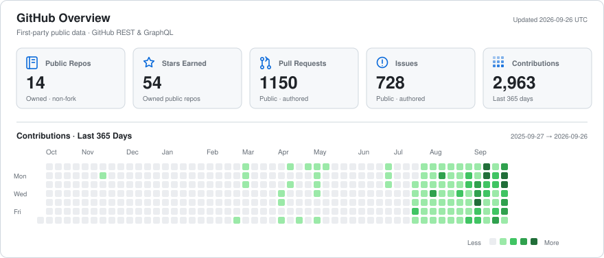

# luceat-lux-vestra

### Backend Engineer

I primarily build backend systems with **Java, Kotlin, and Spring**,  
but I'm comfortable working across the stack when needed.

I enjoy building reliable systems, integrations, and developer tools around problems I actually encounter.

I started my career in game development before moving into backend engineering,  
and I still enjoy understanding how software works beyond my primary stack.

 

**Primary Stack**

  

**Also Building With**

  

---

## Selected Work

<table>
<tr>
<td width="50%" valign="top">

### [Zed Spring Tools](https://github.com/luceat-lux-vestra/zed-spring-tools)

Spring Boot language intelligence for Zed, integrating Spring Tools with Zed's native language-server and editor capabilities.

</td>
<td width="50%" valign="top">

### [OxideBatch](https://github.com/luceat-lux-vestra/oxide-batch)

A framework for reliable, restartable batch processing built around durable execution semantics, explicit transaction boundaries, recovery, and evidence-driven compatibility.

</td>
</tr>
<tr>
<td width="50%" valign="top">

### [zMyBatis](https://github.com/luceat-lux-vestra/zMyBatis-public)

A JetBrains IDE plugin for evaluating MyBatis dynamic SQL with parameters and executing the resolved native SQL through the IDE's database tooling.

</td>
<td width="50%" valign="top">

### [CrossInput](https://github.com/luceat-lux-vestra/crossinput)

A DeX-first macOS-to-Android input bridge that hands keyboard and pointer control across devices using ADB and native input paths.

</td>
</tr>
<tr>
<td width="50%" valign="top">

### [MarkFlow](https://github.com/luceat-lux-vestra/MarkFlow-public)

A Typora-style WYSIWYG Markdown editor for IntelliJ-based IDEs, built around a native IntelliJ `FileEditor`, JCEF, and Milkdown.

</td>
<td width="50%" valign="top">

### [Scribium](https://github.com/luceat-lux-vestra/scribium)

An independent Quarkdown-compatible document compiler and toolchain with a backend-neutral IR and Typst/PDF output pipeline.

</td>
</tr>
<tr>
<td colspan="2" valign="top">

### [erdMaid](https://github.com/luceat-lux-vestra/erdMaid-public)

A JetBrains IDE plugin that exports real database table metadata and relationships as Mermaid ER diagrams.

</td>
</tr>
</table>

---

## Latest Writing

<!-- LATEST-WRITING:START -->
- [Spring Boot development works in Zed now](https://blog.ox0.uk/zed-spring-tools/) — 2026-07-26
- [Right-click a table, get a Mermaid ERD — introducing erdMaid](https://blog.ox0.uk/erdmaid-en-2/) — 2026-07-26
- [erdMaid: Export Database Tables to Perfect Mermaid ERDs](https://blog.ox0.uk/erdmaid-en/) — 2026-05-03
<!-- LATEST-WRITING:END -->

---

## Open Source Contributions

<!-- OSS-CONTRIBUTIONS:START -->
- **Issue** · [usebruno/bruno#9063: Windows System Proxy with a fixed proxy adds 20–30s delay per request, while manual proxy is fast](https://github.com/usebruno/bruno/issues/9063) — 2026-08-29
- **PR** · [zed-industries/extensions#6875: Add Spring Tools extension](https://github.com/zed-industries/extensions/pull/6875) — 2026-08-18
- **PR** · [usebruno/bruno-vscode#126: Fix: proxy settings not working — use proxy agents, parse system env vars, remove hardcoded defaults](https://github.com/usebruno/bruno-vscode/pull/126) — 2026-08-15
- **Issue** · [yuin/rushdown#2: Safe Index/Segment APIs can invoke UB through unchecked string slicing](https://github.com/yuin/rushdown/issues/2) — 2026-08-12
<!-- OSS-CONTRIBUTIONS:END -->

---

## Recent Open Source Activity

<!-- RECENT-ACTIVITY:START -->
_No recent public activity in external repositories found._
<!-- RECENT-ACTIVITY:END -->

---

## GitHub

<picture>
  <source srcset="./assets/github-overview-dark.svg" media="(prefers-color-scheme: dark)" />
  <source srcset="./assets/github-overview-light.svg" media="(prefers-color-scheme: light), (prefers-color-scheme: no-preference)" />
  
</picture>

